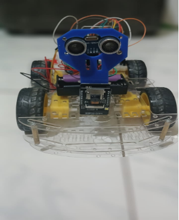
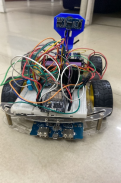
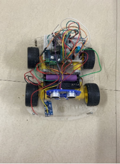
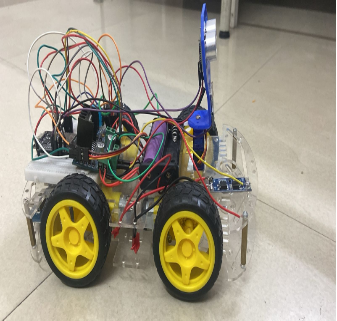
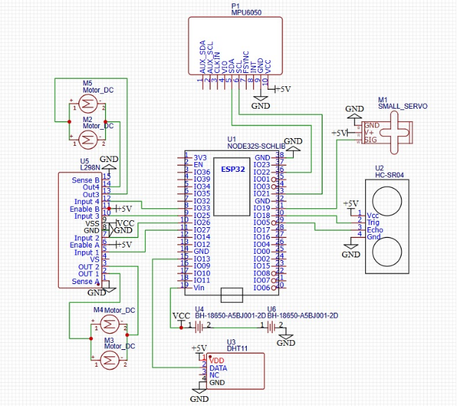
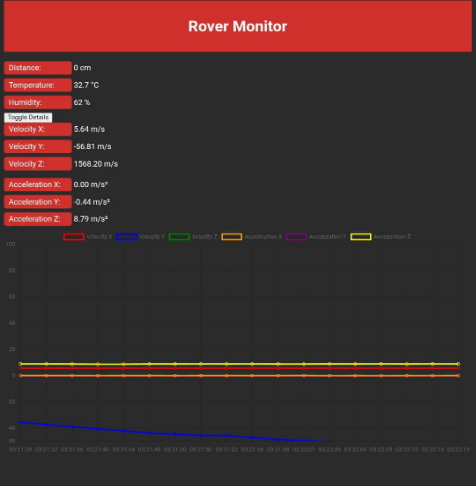
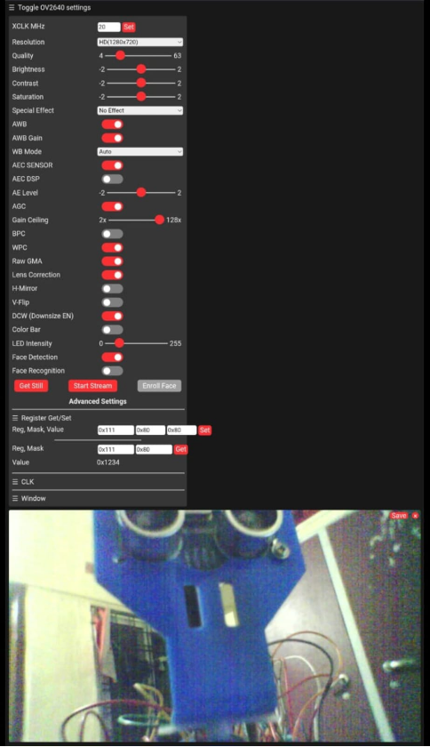

## **Autonomous Rover monitor via ESP32 and ESP-32 CAM**

This repository contains the design, code, and documentation for my **Autonomous Rover** project.  The rover uses sensors, embedded control, and decision-making algorithms to navigate environments without human intervention.

Developed an intelligent, Wi-Fi-enabled autonomous land rover capable of real-time environmental monitoring and edge-based AI for object detection. Utilized ESP32 and ESP32-CAM for live streaming and sensor integration, implementing obstacle avoidance using ultrasonic and IMU sensor fusion. Designed a responsive web interface for live telemetry, integrating Edge Impulse-trained models for onboard computer vision without cloud dependency. This project was an extension of our gesture-controlled robot work, transforming it into a scalable, autonomous platform for surveillance, inspection, and smart navigation.

 

## Project Overview:









The rover is built with:
- **Chassis:** 4-wheel or tracked platform.
- **Sensors:** Ultrasonic HCSR-04,DHT11,MPU6050.
- **Controller:** ESP-32 and ESP-32 CAM.
- **Actuation:** DC motors with motor driver(L298N).
- **Power:** Li-ion battery pack and 2S-Li ion BMS.
- **converter:** Used 3.7v to 5V converter JX-885Y( To provide power supply to Microcontrollers)


## Features:
- **Autonomous Navigation** – Avoids obstacles without remote control.
- **Sensor Fusion** – Combines data from multiple sensors for better decisions.
- **Path Planning** – Algorithm to move toward goals.
- **Failsafe Stop** – Stops rover in case of critical errors.


## How to Run:
1. Clone the repository:
```bash
git clone https://github.com/kafkayash/Autonomous_rover_project.git
cd Autonomous_rover_project
```
2. Open the `iot_autonomous_rover.ino` file and select the ESP-32 board type you are using and make sure to set your baud rate to 1120000 on serial monitor after uploading the code to your board. After its uploaded you will see if its connecting to your wifi or not on the serial monitor. It should get connected within a minute ! but make sure your are using a 4G-connection and if using mobile hotspot set it to 2.4GHZ band instead of 5GHZ band in your settings. ESP-32 has a hard time connecting to 5G networks. Obviosuly change the SSID and Password in the code appropriately.
```c++
// WiFi credentials
const char* ssid = "*****"; //place your wifi name
const char* password = "*****"; //place youe wifi password
```
   
3. Next upload the ESP-32 cam webserver code onto your board. Although i couldn't put the whole Edge based model onto Github since its very large, you can remove the library and upload it and basic ESP-32 cam AI-Thinker has base level facial detection and recognition, for other objects you need to train it and upload the trained model. I used the Edge Impulse for this, although Tedious you get your imported Model without writing any code for it. The process it quite simple you can Refer to the following Video for reference

    [ESP-32 CAM AI-THINKER EDGE IMPULSE](https://youtu.be/HDRvZ_BYd08?si=7uLiEUAztkoOZQOL)

4. Remember to download the appropriate libraries on arduino before uploaing the code, specifically the following ones. Just type their names in the library manager and you can install them.
   ```C++
   #include <WiFi.h>
   #include <WebServer.h>
   #include <Wire.h>
   #include <Adafruit_Sensor.h>
   #include <Adafruit_MPU6050.h>
   #include <DHT.h>
   #include <NewPing.h>
   #include <ESP32Servo.h>
   ```
If its not present in the Library manager just download them online and include it as a ZIP file.  
## Circuit Connections:


These are the connections I have made but you can configure the connections as you wish just make sure to change the pin definitions in the `iot_autonomous_rover.ino` file. Specifically these lines in the code
```C++
//dht11
DHT dht(13, DHT11);

//Motor pins
const int LeftMotorForward = 27;
const int LeftMotorBackward = 26;
const int RightMotorForward = 25;
const int RightMotorBackward = 33;
const int enA = 14;
const int enB = 32;

// Ultrasonic sensor pins
#define trig_pin 5
#define echo_pin 18

//servo motor pins
 servo_motor.attach(19); //60th line in my original code

```
As for the MPU-6050 there is a slight error in the above diagram but generally as per the arduino core definitions/Generic Library definitions most boards use GPIO-21 for **SDA** (Serial Data) and GPIO-22 for **SCL** (Serial Clock). These are standard I2C pins, one transfers data bits (SDA)
[ESP32 master to Slave MPU6050] and the other Synchronizes both the devices with same clock signal(SCL), Data gets transferred over negative edge of SCL-signal.

So since its a standard protocol I see no reason to change the pin definitions but however if you wish to do that for some reason you can force map the new definitions by using the Wire library, However I advice against doing that until and unless you have a proper reason to do so !

If you still wish to do that you can make the following changes to the code:
```C++
#include <Wire.h>
#include <Adafruit_MPU6050.h>

Adafruit_MPU6050 mpu;

void setup() {
  Wire.begin(17, 16); // SDA = GPIO 17, SCL = GPIO 16
  if (!mpu.begin()) {
    Serial.println("Failed to find MPU6050 chip");
    while (1) { delay(10); }
  }
}
```
But remember:
   - Many dev boards (ESP32 DevKitC) have silkscreened “SDA” and “SCL” labels pointing to 21 and 22.
   - Keeps your wiring consistent with most documentation.
   - Avoids conflicts if you’re also using other peripherals on alternate pins.

As for trig and echo pins of ultrasonic sensor its not so strict you can use any GPIO pins on ESP32 as long as they are digital pins.Just check what each pin corresponds to before making any changes and the same goes for Servo motor pin too, it just needs a PWM signal and any GPIO pin on board can generate that.

These are the Circuit connections if you want to follow them as it is (PS: Be careful with motor wire connections to L298N because if you do not understand the transmission logic its easy to messs up Forward and Backward motion)
| Component          | Connected To (ESP32 pins) | Other pins                              | Power             |
|--------------------|---------------------------|------------------------------------------|-------------------|
| **L298N**          | IN1 → GPIO 27 <br> IN2 → GPIO 26 <br> IN3 → GPIO 25 <br> IN4 → GPIO 33 | OUT 1/2 → Left motors <br> OUT 3/4 → Right motors | VCC → 12V <br> GND → GND |
| **HC-SR04**        | Trig → GPIO 5 <br> Echo → GPIO 18 | NIL                                      | VCC → 5V <br> GND → GND |
| **MPU6050**        | SDA → GPIO 21 <br> SCL → GPIO 22 | INT, CLK, VIO not connected               | VCC → 5V <br> GND → GND |
| **DHT11**          | DATA → GPIO 13             | NC (not connected)                       | VCC → 5V <br> GND → GND |
| **SG-90 servo motor** | Signal → GPIO 19         | NIL                                      | VCC → 5V <br> GND → GND |
| **Battery (2S 18650)** | ESP32 VIN               | Connected to all +5V rails                | NIL               |
| **ESP32-node 32s** | NIL                         | Handles Wi-Fi, Webserver, I/O             | Powered by VIN    |

**NOTE:**

I have not used the direct power supply of +5V provided on the L298N H-bridge motor driver. Rememeber that its a begnniers mistake to use them to power your micro controllers. Remeber that L298N is a very outdated motor driver, it still uses the age old darlington pair (BJT based) in its H-bridge configuration. Because of this there is always a lot of noise that is amplified at its terminal outputs and not to mention the worst it draws large currents. Your micro controller already running on WIFI connection here is power hungry and tries to draw ~500mA of current. So this starts becoming a problem here and often it would only work if you added a large enough filter capacitance on the Power rails and still it works in the worst case scenario.

That is why I choose to use external 3.7V supply to power the micrcontrolers but I had to just boost-up the DC-voltage to +5V before proving power( Tried traditional boost converters but for some reason it still failed) This is where I found out that JX-885Y module works the best and it also provided USB port and charging port, so it was the best choice out there.

- Also If you choose to use this project I would definitely suggest to use a different motor driver. And most **IMPORTANTLY** do not forget to use a 2S OR 3S-li ion BMS chip for the Li-ion cells. I say this because if the module is running for extended periods the Li-ion batteries degrade so rapidly because B0-motors so efficent at one thing that is drawing large currents !. once they go below 1.5V its impossible to recover them( practically in dead zone) unless you have specicialized equipment. Having an on Board BMS is always recommended unless you are super rich and can afford to buy New Li-ion batteries after each use. As for the connections you can find them anywhere online and its super straightforward.( Just Make sure to see the specifications before using one atleast use 2S li ion of 7V, 10A rating anf if using 12v battery connection then 3S-BMS of 11.4V,18A rating).

 ## Dashbaord:

Once the connections are done and the code is uploaded without any issue. you can just open the dashboard website, by going to chrome and opening the IP-address port printed on the serial monitor( For both the ESP-32 and ESP-32 CAM). You will see the following with Live data being updated on dashboard for every 2 seconds or so. But it wont be surprising to see if it takes even longer, we are using a basic websockett protocol for this and sometimes the latency gets very high especially when running on extended periods. 





You can increase on decrease data transfer rate over the web by changing the following lines of code :
```C++

 


   
